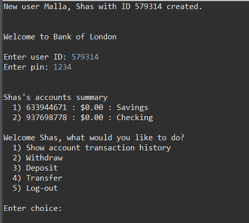

# ATM-Console

This is a console application that gives you simulation of a real ATM machine. It is made in Java and has been implemented with fundamental OOP concepts.

## Some key features
- You can instantiate an object of User to create a new user with its ID and pin.
- Log-in system that verifies the ID and pin.
- Withdraw funds.
- Deposit funds.
- Transfer funds to another account of the user.
- Display the transaction history of the user.
